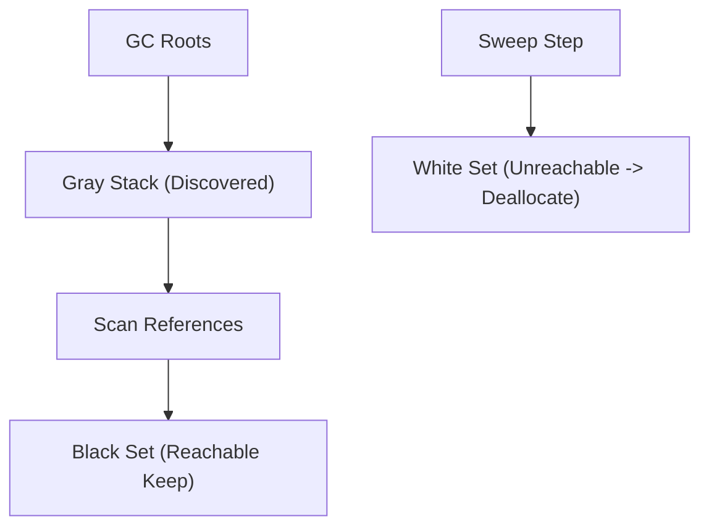

# Tri-Color Mark-and-Sweep Garbage Collection Skill

Robust, zero-dependency Python implementation of **Tri-Color Mark-and-Sweep Garbage Collection**.

## Features
- **Tri-Color Abstraction**: Strictly separates White (unvisited candidate garbage), Gray (in-progress), and Black (reachable).
- **Exact Graph Reachability**: Completely prevents dangling pointers and leaks.
- **Zero External Dependencies**: Pure Python standard library.
- **Native MCP Protocol**: JSON-RPC 2.0 stdio server compatible with Claude Desktop, Cursor, and Windsurf.

## Architecture

